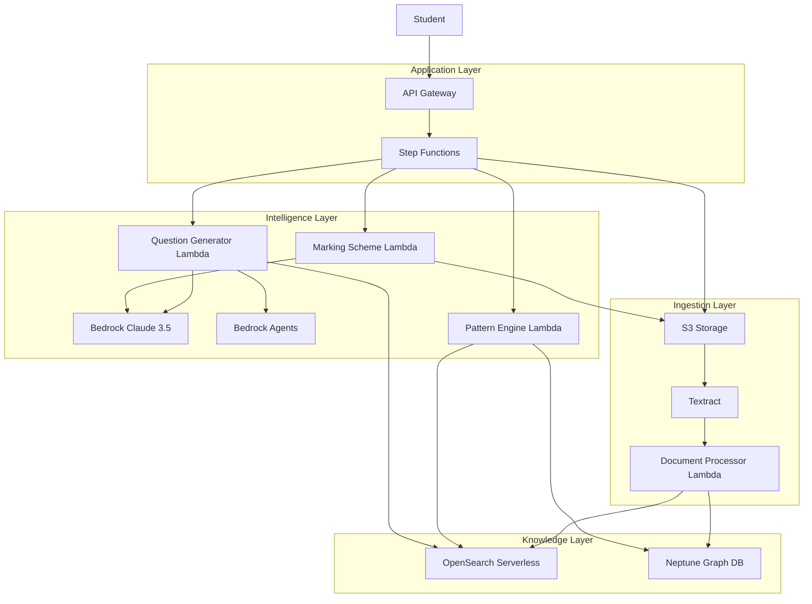
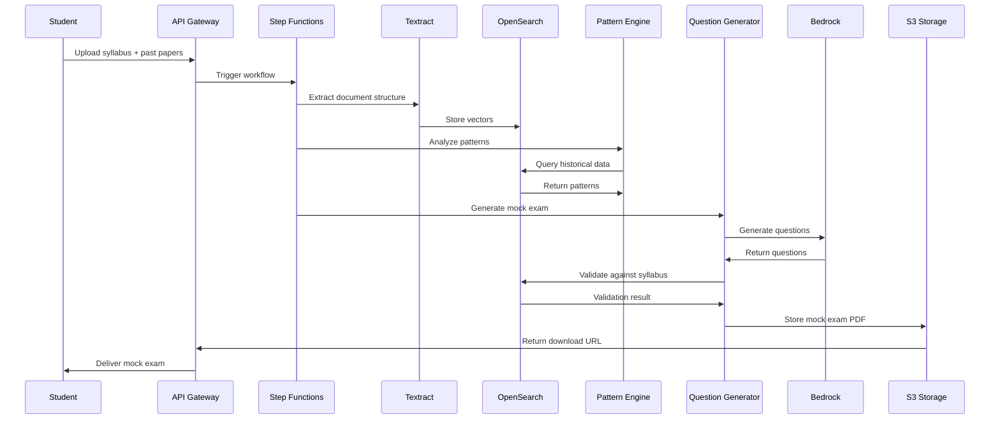

# Design Document: ExamGenius AI

## Overview

ExamGenius AI is a serverless, multi-agent AI system built on AWS that analyzes historical university exam papers to generate high-fidelity mock exams. The system employs a Structural RAG architecture that preserves document structure and relationships, enabling it to reverse-engineer university pedagogy and create practice exams that authentically replicate real exam patterns.

The architecture is organized into four primary layers:
1. **Ingestion Layer**: Document intake and structure extraction
2. **Intelligence Layer**: AI reasoning and content generation
3. **Knowledge Layer**: Vector and graph-based data storage
4. **Application Layer**: API endpoints and workflow orchestration

The system differentiates itself from generic AI tools by maintaining strict curriculum alignment through vector-based syllabus guardrails and by learning institution-specific patterns from historical data.

## Architecture

### High-Level Architecture



### Component Interaction Flow

1. **Document Upload Flow**: Student → API Gateway → S3 → Textract → Document Processor → OpenSearch/Neptune
2. **Pattern Analysis Flow**: Step Functions → Pattern Engine → Neptune/OpenSearch → Pattern Results
3. **Mock Exam Generation Flow**: Step Functions → Question Generator → Bedrock → Syllabus Validation (OpenSearch) → PDF Generation → S3
4. **Marking Scheme Flow**: Step Functions → Marking Scheme Generator → Bedrock → PDF Generation → S3

### Data Flow



## Components and Interfaces

### 1. API Gateway Layer

**Purpose**: Provides RESTful endpoints for frontend integration and handles authentication.

**Endpoints**:
- `POST /upload/syllabus` - Upload syllabus document
- `POST /upload/past-papers` - Upload historical exam papers
- `POST /generate/mock-exam` - Initiate mock exam generation
- `GET /status/{jobId}` - Poll workflow status
- `GET /download/{examId}` - Download generated exam and marking scheme
- `POST /universities` - Register new university configuration

**Authentication**: AWS Cognito integration for student authentication

**Interface**:
```typescript
interface UploadSyllabusRequest {
  universityId: string;
  courseCode: string;
  file: File; // PDF or text
}

interface UploadPastPapersRequest {
  universityId: string;
  courseCode: string;
  files: File[]; // Array of PDF files
  years: number[]; // Corresponding years
}

interface GenerateMockExamRequest {
  studentId: string;
  universityId: string;
  courseCode: string;
  examDuration: number; // minutes
  totalMarks: number;
  preferences?: {
    focusModules?: string[];
    questionTypes?: string[];
  };
}

interface JobStatusResponse {
  jobId: string;
  status: 'PENDING' | 'PROCESSING' | 'COMPLETED' | 'FAILED';
  progress: number; // 0-100
  currentStep: string;
  estimatedTimeRemaining?: number; // seconds
  error?: string;
}

interface DownloadResponse {
  examPdfUrl: string;
  markingSchemePdfUrl: string;
  metadata: {
    generatedAt: string;
    totalMarks: number;
    questionCount: number;
    modules: string[];
  };
}
```

### 2. Document Processor (Lambda)

**Purpose**: Orchestrates Textract extraction and structures data for storage.

**Inputs**: S3 event notification with PDF location

**Outputs**: Structured document data to OpenSearch and Neptune

**Processing Steps**:
1. Invoke Textract with TABLES and FORMS analysis
2. Parse Textract JSON response
3. Extract questions, marks, and module mappings
4. Convert mathematical notation to LaTeX
5. Create vector embeddings for text content
6. Store vectors in OpenSearch
7. Store relationships in Neptune

**Interface**:
```typescript
interface TextractResult {
  documentId: string;
  pages: Page[];
  tables: Table[];
  forms: Form[];
  confidence: number;
}

interface Page {
  pageNumber: number;
  text: string;
  blocks: Block[];
}

interface Block {
  blockType: 'LINE' | 'WORD' | 'TABLE' | 'CELL';
  text: string;
  confidence: number;
  geometry: BoundingBox;
}

interface ExtractedQuestion {
  questionNumber: string;
  questionText: string;
  marks: number;
  questionType: 'MCQ' | 'SHORT' | 'LONG' | 'NUMERICAL' | 'DERIVATION';
  module?: string;
  year: number;
  mathematicalContent: boolean;
  latexEquations?: string[];
}

interface StructuredDocument {
  documentId: string;
  documentType: 'SYLLABUS' | 'PAST_PAPER';
  universityId: string;
  courseCode: string;
  year?: number;
  questions?: ExtractedQuestion[];
  modules?: Module[];
  totalMarks?: number;
}
```

### 3. Pattern Engine (Lambda)

**Purpose**: Analyzes historical patterns and identifies hot topics.

**Inputs**: Course code, university ID, years range

**Outputs**: Pattern analysis report with hot topics and weightages

**Analysis Algorithms**:
1. **Frequency Analysis**: Count module appearances across years
2. **Recency Weighting**: Apply decay function to older papers
3. **Overdue Detection**: Identify modules absent for N years
4. **Question Type Distribution**: Calculate percentage of each type
5. **Mark Distribution**: Compute average marks per module

**Interface**:
```typescript
interface PatternAnalysisRequest {
  universityId: string;
  courseCode: string;
  yearsRange: { start: number; end: number };
}

interface PatternAnalysisResult {
  hotTopics: HotTopic[];
  questionTypeDistribution: QuestionTypeDistribution;
  markDistribution: MarkDistribution;
  trends: Trend[];
}

interface HotTopic {
  module: string;
  confidenceScore: number; // 0-1
  historicalFrequency: number; // appearances per year
  lastAppearance: number; // year
  predictedLikelihood: number; // 0-1
  averageMarks: number;
}

interface QuestionTypeDistribution {
  MCQ: number; // percentage
  SHORT: number;
  LONG: number;
  NUMERICAL: number;
  DERIVATION: number;
}

interface MarkDistribution {
  moduleWeightages: Map<string, number>; // module -> average marks
  trends: 'INCREASING' | 'DECREASING' | 'STABLE';
}

interface Trend {
  module: string;
  direction: 'UP' | 'DOWN' | 'STABLE';
  changeRate: number; // percentage change per year
}
```

**Algorithms**:

```python
# Frequency Analysis with Recency Weighting
def calculate_hot_topics(past_papers, current_year):
    module_scores = {}
    decay_factor = 0.9  # Older papers have less weight
    
    for paper in past_papers:
        years_ago = current_year - paper.year
        weight = decay_factor ** years_ago
        
        for question in paper.questions:
            if question.module not in module_scores:
                module_scores[question.module] = {
                    'weighted_count': 0,
                    'total_marks': 0,
                    'last_seen': 0
                }
            
            module_scores[question.module]['weighted_count'] += weight
            module_scores[question.module]['total_marks'] += question.marks
            module_scores[question.module]['last_seen'] = max(
                module_scores[question.module]['last_seen'],
                paper.year
            )
    
    # Calculate overdue bonus
    for module, scores in module_scores.items():
        years_absent = current_year - scores['last_seen']
        if years_absent >= 2:
            overdue_bonus = min(years_absent * 0.2, 0.8)
            scores['weighted_count'] *= (1 + overdue_bonus)
    
    return module_scores

# Question Type Distribution
def calculate_question_type_distribution(past_papers):
    type_counts = defaultdict(int)
    total = 0
    
    for paper in past_papers:
        for question in paper.questions:
            type_counts[question.questionType] += 1
            total += 1
    
    return {qtype: (count / total) * 100 
            for qtype, count in type_counts.items()}
```

### 4. Question Generator (Lambda)

**Purpose**: Generates exam questions using Bedrock with syllabus constraints.

**Inputs**: Pattern analysis, syllabus vectors, exam specifications

**Outputs**: Generated questions with metadata

**Generation Process**:
1. Select modules based on hot topic scores
2. Determine question types based on historical distribution
3. For each question:
   - Generate question using Bedrock with module context
   - Validate against syllabus using vector similarity
   - Retry if similarity < threshold
   - Assign marks based on historical patterns
4. Ensure total marks match target
5. Format questions in exam paper structure

**Interface**:
```typescript
interface QuestionGenerationRequest {
  patternAnalysis: PatternAnalysisResult;
  syllabusVectors: VectorStore;
  examSpec: {
    totalMarks: number;
    duration: number;
    questionCount: number;
  };
  universityConfig: UniversityConfig;
}

interface GeneratedQuestion {
  questionNumber: string;
  module: string;
  questionType: string;
  questionText: string;
  marks: number;
  subParts?: SubPart[];
  syllabusAlignment: number; // similarity score
  difficulty: 'EASY' | 'MEDIUM' | 'HARD';
}

interface SubPart {
  partLabel: string; // (a), (b), (c)
  text: string;
  marks: number;
}

interface MockExam {
  examId: string;
  universityId: string;
  courseCode: string;
  generatedAt: string;
  totalMarks: number;
  duration: number;
  questions: GeneratedQuestion[];
  instructions: string[];
}
```

**Bedrock Prompt Template**:
```
You are an expert exam question generator for {university} university.

Context:
- Course: {courseCode}
- Module: {moduleName}
- Module Content: {moduleDescription}
- Question Type: {questionType}
- Marks: {marks}
- Historical Examples: {exampleQuestions}

Generate a {questionType} question worth {marks} marks that:
1. Tests understanding of {moduleName}
2. Matches the difficulty and style of historical examples
3. Stays strictly within the module content provided
4. Is appropriate for {marks} marks allocation

Question:
```

### 5. Syllabus Validator

**Purpose**: Ensures generated questions align with syllabus using vector similarity.

**Process**:
1. Receive generated question text
2. Create embedding for question
3. Query OpenSearch for top-k similar syllabus sections
4. Calculate maximum similarity score
5. Return validation result

**Interface**:
```typescript
interface ValidationRequest {
  questionText: string;
  module: string;
}

interface ValidationResult {
  isValid: boolean;
  similarityScore: number;
  matchedSyllabusSection: string;
  confidence: number;
}

const SIMILARITY_THRESHOLD = 0.75;

async function validateQuestion(
  question: string,
  syllabusVectorStore: OpenSearchClient
): Promise<ValidationResult> {
  const questionEmbedding = await createEmbedding(question);
  
  const searchResult = await syllabusVectorStore.search({
    vector: questionEmbedding,
    k: 5,
    filter: { module: question.module }
  });
  
  const maxSimilarity = Math.max(...searchResult.map(r => r.score));
  
  return {
    isValid: maxSimilarity >= SIMILARITY_THRESHOLD,
    similarityScore: maxSimilarity,
    matchedSyllabusSection: searchResult[0].text,
    confidence: maxSimilarity
  };
}
```

### 6. Marking Scheme Generator (Lambda)

**Purpose**: Creates detailed marking schemes with step-wise mark allocation.

**Inputs**: Generated mock exam questions

**Outputs**: Marking scheme document with model answers

**Generation Process**:
1. For each question, generate model answer using Bedrock
2. Break down marks into steps/key points
3. Include partial marking criteria
4. Add diagrams/formulas where applicable
5. Format as structured document

**Interface**:
```typescript
interface MarkingSchemeRequest {
  mockExam: MockExam;
}

interface MarkingScheme {
  examId: string;
  questions: QuestionMarkingScheme[];
  totalMarks: number;
}

interface QuestionMarkingScheme {
  questionNumber: string;
  totalMarks: number;
  modelAnswer: string;
  markingBreakdown: MarkingStep[];
  commonMistakes?: string[];
}

interface MarkingStep {
  step: string;
  description: string;
  marks: number;
  isPartialCredit: boolean;
  keywords?: string[]; // Key terms that must be present
}
```

**Bedrock Prompt for Marking Scheme**:
```
Generate a detailed marking scheme for this question:

Question: {questionText}
Total Marks: {marks}
Module: {module}

Provide:
1. A complete model answer
2. Step-by-step mark allocation
3. Partial credit criteria
4. Key points that must be mentioned
5. Common mistakes to avoid

Format as a structured marking guide for examiners.
```

### 7. PDF Generator

**Purpose**: Converts structured exam and marking scheme data to formatted PDFs.

**Technology**: AWS Lambda with headless Chrome or LaTeX rendering

**Features**:
- University-specific header/footer templates
- Mathematical equation rendering (LaTeX)
- Table formatting
- Watermarking
- Page numbering

**Interface**:
```typescript
interface PDFGenerationRequest {
  documentType: 'EXAM' | 'MARKING_SCHEME';
  content: MockExam | MarkingScheme;
  template: UniversityTemplate;
}

interface UniversityTemplate {
  universityId: string;
  headerHtml: string;
  footerHtml: string;
  styling: CSSStyles;
  logoUrl: string;
}

interface PDFGenerationResult {
  pdfUrl: string; // S3 presigned URL
  pageCount: number;
  fileSize: number;
}
```

### 8. Step Functions Workflow

**Purpose**: Orchestrates the end-to-end mock exam generation workflow.

**States**:
1. **ValidateInput**: Check all required inputs present
2. **ProcessDocuments**: Parallel processing of syllabus and past papers
3. **AnalyzePatterns**: Run pattern engine
4. **GenerateQuestions**: Create mock exam questions
5. **ValidateQuestions**: Check syllabus alignment
6. **GenerateMarkingScheme**: Create answer key
7. **GeneratePDFs**: Create downloadable documents
8. **NotifyStudent**: Send completion notification

**Error Handling**: Each state has retry logic with exponential backoff

**State Machine Definition**:
```json
{
  "StartAt": "ValidateInput",
  "States": {
    "ValidateInput": {
      "Type": "Task",
      "Resource": "arn:aws:lambda:...:function:ValidateInput",
      "Next": "ProcessDocuments",
      "Catch": [{
        "ErrorEquals": ["ValidationError"],
        "Next": "HandleError"
      }]
    },
    "ProcessDocuments": {
      "Type": "Parallel",
      "Branches": [
        {
          "StartAt": "ProcessSyllabus",
          "States": {
            "ProcessSyllabus": {
              "Type": "Task",
              "Resource": "arn:aws:lambda:...:function:ProcessSyllabus",
              "End": true
            }
          }
        },
        {
          "StartAt": "ProcessPastPapers",
          "States": {
            "ProcessPastPapers": {
              "Type": "Task",
              "Resource": "arn:aws:lambda:...:function:ProcessPastPapers",
              "End": true
            }
          }
        }
      ],
      "Next": "AnalyzePatterns"
    },
    "AnalyzePatterns": {
      "Type": "Task",
      "Resource": "arn:aws:lambda:...:function:AnalyzePatterns",
      "Next": "GenerateQuestions",
      "Retry": [{
        "ErrorEquals": ["States.ALL"],
        "MaxAttempts": 3,
        "BackoffRate": 2.0
      }]
    },
    "GenerateQuestions": {
      "Type": "Task",
      "Resource": "arn:aws:lambda:...:function:GenerateQuestions",
      "Next": "ValidateQuestions"
    },
    "ValidateQuestions": {
      "Type": "Task",
      "Resource": "arn:aws:lambda:...:function:ValidateQuestions",
      "Next": "CheckValidation"
    },
    "CheckValidation": {
      "Type": "Choice",
      "Choices": [{
        "Variable": "$.allQuestionsValid",
        "BooleanEquals": true,
        "Next": "GenerateMarkingScheme"
      }],
      "Default": "GenerateQuestions"
    },
    "GenerateMarkingScheme": {
      "Type": "Task",
      "Resource": "arn:aws:lambda:...:function:GenerateMarkingScheme",
      "Next": "GeneratePDFs"
    },
    "GeneratePDFs": {
      "Type": "Parallel",
      "Branches": [
        {
          "StartAt": "GenerateExamPDF",
          "States": {
            "GenerateExamPDF": {
              "Type": "Task",
              "Resource": "arn:aws:lambda:...:function:GeneratePDF",
              "End": true
            }
          }
        },
        {
          "StartAt": "GenerateSchemePDF",
          "States": {
            "GenerateSchemePDF": {
              "Type": "Task",
              "Resource": "arn:aws:lambda:...:function:GeneratePDF",
              "End": true
            }
          }
        }
      ],
      "Next": "NotifyStudent"
    },
    "NotifyStudent": {
      "Type": "Task",
      "Resource": "arn:aws:lambda:...:function:NotifyStudent",
      "End": true
    },
    "HandleError": {
      "Type": "Task",
      "Resource": "arn:aws:lambda:...:function:HandleError",
      "End": true
    }
  }
}
```

## Data Models

### OpenSearch Document Schemas

**Syllabus Vector Document**:
```typescript
interface SyllabusVectorDocument {
  id: string;
  universityId: string;
  courseCode: string;
  module: string;
  topic: string;
  content: string;
  embedding: number[]; // 1536-dimensional vector
  learningObjectives: string[];
  keywords: string[];
  metadata: {
    uploadedAt: string;
    version: string;
  };
}
```

**Past Paper Vector Document**:
```typescript
interface PastPaperVectorDocument {
  id: string;
  universityId: string;
  courseCode: string;
  year: number;
  questionNumber: string;
  questionText: string;
  embedding: number[];
  module: string;
  questionType: string;
  marks: number;
  difficulty: string;
  hasMatematicalContent: boolean;
  metadata: {
    extractedAt: string;
    confidence: number;
  };
}
```

### Neptune Graph Schema

**Nodes**:
- **Module**: Represents a course module/topic
- **Question**: Represents an exam question
- **Year**: Represents an exam year
- **QuestionType**: Represents question category

**Edges**:
- **APPEARS_IN**: Module → Year (weight: frequency)
- **HAS_QUESTION**: Year → Question
- **BELONGS_TO**: Question → Module
- **IS_TYPE**: Question → QuestionType
- **ALLOCATES_MARKS**: Question → Module (weight: marks)

**Graph Queries**:
```cypher
// Find hot topics (modules appearing frequently)
MATCH (m:Module)-[a:APPEARS_IN]->(y:Year)
WHERE y.year >= $startYear AND y.year <= $endYear
WITH m, COUNT(a) as frequency, MAX(y.year) as lastSeen
RETURN m.name, frequency, lastSeen
ORDER BY frequency DESC

// Find mark distribution per module
MATCH (q:Question)-[am:ALLOCATES_MARKS]->(m:Module)
WHERE q.year >= $startYear
WITH m, AVG(am.marks) as avgMarks, SUM(am.marks) as totalMarks
RETURN m.name, avgMarks, totalMarks
ORDER BY totalMarks DESC

// Find question type distribution
MATCH (q:Question)-[it:IS_TYPE]->(qt:QuestionType)
WHERE q.year >= $startYear
WITH qt, COUNT(q) as count
RETURN qt.name, count
ORDER BY count DESC
```

### DynamoDB Tables (for metadata)

**Students Table**:
```typescript
interface StudentRecord {
  studentId: string; // Partition key
  email: string;
  universityId: string;
  enrolledCourses: string[];
  createdAt: string;
  lastLogin: string;
}
```

**Jobs Table**:
```typescript
interface JobRecord {
  jobId: string; // Partition key
  studentId: string; // GSI partition key
  status: string;
  workflowExecutionArn: string;
  createdAt: string; // GSI sort key
  completedAt?: string;
  examId?: string;
  error?: string;
}
```

**Universities Table**:
```typescript
interface UniversityRecord {
  universityId: string; // Partition key
  name: string;
  location: string;
  config: {
    examDuration: number;
    totalMarks: number;
    questionFormat: string;
    headerTemplate: string;
    footerTemplate: string;
  };
  courses: CourseConfig[];
}

interface CourseConfig {
  courseCode: string;
  courseName: string;
  modules: string[];
  creditHours: number;
}
```


## Correctness Properties

*A property is a characteristic or behavior that should hold true across all valid executions of a system—essentially, a formal statement about what the system should do. Properties serve as the bridge between human-readable specifications and machine-verifiable correctness guarantees.*

### Property 1: Document Upload and Storage Round-Trip

*For any* valid PDF document uploaded by a student, the document should be stored in S3, processed by Textract, and the extracted structured data should be retrievable from OpenSearch or Neptune.

**Validates: Requirements 1.1, 1.2, 1.3, 1.4, 1.5**

### Property 2: Syllabus Processing Pipeline Completeness

*For any* syllabus document (PDF or text format), when uploaded, the system should extract modules and topics, create vector embeddings, store them in OpenSearch, and confirm successful processing.

**Validates: Requirements 2.1, 2.2, 2.3, 2.4, 2.5**

### Property 3: Error Message Descriptiveness

*For any* invalid file upload or processing failure, the system should return an error message that describes the problem without exposing internal system details.

**Validates: Requirements 1.6, 2.6, 15.4**

### Property 4: Parallel Processing of Multiple Documents

*For any* set of N documents uploaded simultaneously by different students, the system should process them concurrently, with each processing completing independently.

**Validates: Requirements 1.7, 11.2**

### Property 5: Module Frequency Calculation Accuracy

*For any* collection of past papers, the Pattern Engine should calculate module frequency such that the sum of all module appearances equals the total number of questions across all papers.

**Validates: Requirements 3.1, 3.2**

### Property 6: Question Type Categorization Consistency

*For any* question extracted from past papers, the Pattern Engine should assign exactly one question type category (MCQ, SHORT, LONG, NUMERICAL, or DERIVATION).

**Validates: Requirements 3.3, 14.1**

### Property 7: Overdue Module Detection

*For any* module that has not appeared in the last N years (where N ≥ 2), the Pattern Engine should flag it as statistically overdue with an increased confidence score.

**Validates: Requirements 3.4**

### Property 8: Hot Topic List Completeness

*For any* pattern analysis result, the hot topic list should include confidence scores, historical frequency, and predicted likelihood for each identified module.

**Validates: Requirements 3.5, 3.6**

### Property 9: Minimum Historical Data Requirement

*For any* pattern analysis request with fewer than 5 years of past papers, the system should either reject the request or return a warning about reduced statistical reliability.

**Validates: Requirements 3.7**

### Property 10: Mark Extraction and Module Mapping Consistency

*For any* past paper, the sum of extracted marks for all questions should equal the total marks specified in the paper header, and each question should be mapped to exactly one module.

**Validates: Requirements 4.1, 4.2**

### Property 11: Average Marks Calculation Correctness

*For any* module across multiple years, the calculated average marks should equal the sum of all marks allocated to that module divided by the number of years it appeared.

**Validates: Requirements 4.4**

### Property 12: Mock Exam Total Marks Invariant

*For any* generated mock exam, the sum of marks across all questions should exactly equal the target total marks specified in the exam request.

**Validates: Requirements 5.8, 7.6**

### Property 13: Hot Topic Prioritization in Question Selection

*For any* generated mock exam, modules identified as hot topics should appear with higher frequency than non-hot-topic modules, proportional to their confidence scores.

**Validates: Requirements 5.3**

### Property 14: Question Type Distribution Matching

*For any* generated mock exam, the distribution of question types should match the historical distribution from past papers within a 10% tolerance for each question type.

**Validates: Requirements 5.4, 14.3**

### Property 15: Mark Distribution Pattern Adherence

*For any* generated mock exam, the mark allocation across modules should follow the historical mark distribution patterns, with each module receiving marks proportional to its historical average within 15% tolerance.

**Validates: Requirements 5.5**

### Property 16: Syllabus Alignment Validation

*For any* generated question, the vector similarity score against the syllabus should be at least 0.75, and any question with a lower score should be rejected and regenerated.

**Validates: Requirements 6.1, 6.2, 6.3, 6.4, 6.5**

### Property 17: Rejected Question Logging

*For any* question rejected due to low syllabus similarity, the system should create a log entry containing the question text, similarity score, and timestamp.

**Validates: Requirements 6.6**

### Property 18: Marking Scheme Completeness

*For any* generated mock exam, the corresponding marking scheme should include step-wise mark allocation, model answers, and partial credit criteria for every question in the exam.

**Validates: Requirements 7.1, 7.2, 7.3, 7.4**

### Property 19: PDF Generation Success

*For any* completed mock exam and marking scheme, the system should generate valid, downloadable PDF files that can be opened without errors.

**Validates: Requirements 5.7, 7.5**

### Property 20: Workflow Sequential Execution

*For any* mock exam generation workflow, the components (Textract, Pattern Engine, Question Generator, Marking Scheme Generator) should execute in the correct sequence, with each component receiving the output of its predecessor.

**Validates: Requirements 8.2, 8.3**

### Property 21: Retry Logic with Exponential Backoff

*For any* component failure during workflow execution, the system should retry up to 3 times with exponentially increasing delays (e.g., 1s, 2s, 4s) before reporting a final error.

**Validates: Requirements 8.4, 11.6**

### Property 22: Workflow Completion Notification

*For any* successfully completed workflow, the system should send a notification to the student containing valid download URLs for both the mock exam and marking scheme PDFs.

**Validates: Requirements 8.5**

### Property 23: Workflow State Persistence

*For any* workflow that fails mid-execution, the system should persist the current state such that the workflow can resume from the last successful step rather than restarting from the beginning.

**Validates: Requirements 8.6**

### Property 24: University-Specific Configuration Application

*For any* selected university, the system should load and apply that university's specific configuration (exam duration, mark distribution, formatting rules) to all generated mock exams.

**Validates: Requirements 9.2, 9.3**

### Property 25: University-Specific Data Filtering

*For any* pattern analysis request, the system should use only past papers from the selected university, excluding papers from all other universities.

**Validates: Requirements 9.4**

### Property 26: API Async Job Response

*For any* mock exam generation request via the API, the system should immediately return a unique job ID without waiting for processing to complete.

**Validates: Requirements 10.3**

### Property 27: API Status Polling Accuracy

*For any* job ID, polling the status endpoint should return the current workflow state, and once complete, should provide valid download URLs.

**Validates: Requirements 10.4, 10.5**

### Property 28: API Authentication Enforcement

*For any* API endpoint request without valid authentication credentials, the system should reject the request with a 401 Unauthorized status code.

**Validates: Requirements 10.6**

### Property 29: HTTP Status Code Correctness

*For any* API request, the system should return appropriate HTTP status codes: 200 for success, 400 for client errors, 401 for authentication failures, 500 for server errors.

**Validates: Requirements 10.7**

### Property 30: Secure Document Storage

*For any* document uploaded to S3, the system should enable encryption at rest and organize the file path using the pattern: `{studentId}/{timestamp}/{filename}`.

**Validates: Requirements 12.1, 12.2**

### Property 31: Document Retrieval Consistency

*For any* previously generated mock exam, a student should be able to retrieve it from S3 using the exam ID, and the retrieved document should be identical to the originally generated document.

**Validates: Requirements 12.3**

### Property 32: Data Isolation Between Students

*For any* two different students, neither student should be able to access, view, or modify the other student's uploaded documents or generated exams.

**Validates: Requirements 12.7**

### Property 33: Mathematical Content Extraction and Rendering

*For any* PDF containing mathematical equations, the system should extract the equations, convert them to LaTeX format, and render them correctly in the generated mock exam PDF.

**Validates: Requirements 13.1, 13.3, 13.4**

### Property 34: Table Structure Preservation

*For any* PDF containing tables, the extracted table structure should preserve the number of rows, columns, and cell relationships from the original document.

**Validates: Requirements 13.2**

### Property 35: Low Confidence Extraction Flagging

*For any* content extracted with confidence score below a threshold (e.g., 0.7), the system should flag it for manual review and log the low-confidence extraction.

**Validates: Requirements 13.5**

### Property 36: Question Type Distribution Percentage Sum

*For any* calculated question type distribution, the sum of all question type percentages should equal 100%.

**Validates: Requirements 14.2**

### Property 37: Comprehensive Error Logging

*For any* error that occurs in the system, a log entry should be created in CloudWatch containing timestamp, component name, error message, and stack trace.

**Validates: Requirements 15.1, 15.5**

### Property 38: Critical Error Alerting

*For any* critical error (e.g., workflow failure, data corruption), the system should send an alert notification to system administrators within 5 minutes of the error occurrence.

**Validates: Requirements 15.3**

### Property 39: Structured Logging with Correlation IDs

*For any* API request, all log entries generated during the processing of that request should include the same correlation ID, enabling end-to-end request tracing.

**Validates: Requirements 15.6**

## Error Handling

### Error Categories

1. **Validation Errors**: Invalid input data, unsupported file formats, missing required fields
2. **Processing Errors**: Textract failures, extraction errors, low confidence results
3. **Generation Errors**: Bedrock API failures, syllabus alignment failures, insufficient historical data
4. **Infrastructure Errors**: S3 access errors, OpenSearch connection failures, Lambda timeouts
5. **Workflow Errors**: State machine failures, component communication errors

### Error Handling Strategies

**Validation Errors**:
- Return immediately with 400 Bad Request
- Provide specific error message indicating what validation failed
- Do not retry (client must fix input)

**Processing Errors**:
- Retry up to 3 times with exponential backoff
- If Textract confidence < 0.7, flag for manual review but continue processing
- Log all processing errors with full context

**Generation Errors**:
- If question generation fails syllabus validation, regenerate up to 5 times
- If Bedrock API rate limit hit, implement exponential backoff with jitter
- If insufficient historical data, return warning but allow generation with reduced confidence

**Infrastructure Errors**:
- Implement circuit breaker pattern for external service calls
- Retry transient failures (network timeouts, 503 errors) up to 3 times
- For persistent failures, fail workflow and notify administrators

**Workflow Errors**:
- Step Functions automatically retries failed states per configuration
- Persist workflow state before each major step
- Implement dead letter queue for failed workflows
- Send notifications for workflows stuck in PROCESSING state > 30 minutes

### Error Response Format

```typescript
interface ErrorResponse {
  error: {
    code: string; // Machine-readable error code
    message: string; // Human-readable error message
    details?: any; // Additional context (sanitized)
    requestId: string; // Correlation ID for tracing
    timestamp: string;
  };
}

// Example error codes
const ERROR_CODES = {
  INVALID_FILE_FORMAT: 'ERR_001',
  EXTRACTION_FAILED: 'ERR_002',
  INSUFFICIENT_DATA: 'ERR_003',
  SYLLABUS_ALIGNMENT_FAILED: 'ERR_004',
  WORKFLOW_TIMEOUT: 'ERR_005',
  AUTHENTICATION_FAILED: 'ERR_006',
  RATE_LIMIT_EXCEEDED: 'ERR_007',
  INTERNAL_SERVER_ERROR: 'ERR_999'
};
```

### Monitoring and Alerting

**CloudWatch Metrics**:
- Document upload success/failure rate
- Textract extraction confidence scores
- Question generation success rate
- Syllabus alignment scores
- Workflow completion time
- API response times
- Lambda function duration and errors

**Alerts**:
- Error rate > 5% in any component (Warning)
- Error rate > 10% in any component (Critical)
- Workflow completion time > 10 minutes (Warning)
- Any workflow failure (Notification)
- Bedrock API errors (Immediate)
- S3 or OpenSearch unavailability (Critical)

## Testing Strategy

### Dual Testing Approach

The ExamGenius AI system requires both unit testing and property-based testing to ensure comprehensive correctness:

**Unit Tests**: Verify specific examples, edge cases, and error conditions
- Test specific document formats (valid PDFs, corrupted PDFs, non-PDF files)
- Test specific error scenarios (network failures, API rate limits)
- Test integration points between components
- Test edge cases (empty documents, documents with only images, extremely large documents)

**Property-Based Tests**: Verify universal properties across all inputs
- Test that document processing pipeline maintains data integrity for any valid input
- Test that pattern analysis produces mathematically correct results for any set of past papers
- Test that generated exams always satisfy mark total constraints
- Test that syllabus alignment validation works for any question-syllabus pair

### Property-Based Testing Configuration

**Testing Library**: Use `fast-check` for TypeScript/JavaScript components, `Hypothesis` for Python components

**Test Configuration**:
- Minimum 100 iterations per property test
- Each property test references its design document property number
- Tag format: `Feature: exam-genius-ai, Property {number}: {property_text}`

**Example Property Test**:
```typescript
import fc from 'fast-check';

// Feature: exam-genius-ai, Property 12: Mock Exam Total Marks Invariant
describe('Mock Exam Generation', () => {
  it('should generate exams where sum of question marks equals target total', () => {
    fc.assert(
      fc.property(
        fc.record({
          targetMarks: fc.integer({ min: 50, max: 200 }),
          moduleCount: fc.integer({ min: 3, max: 10 }),
          questionTypes: fc.array(fc.constantFrom('MCQ', 'SHORT', 'LONG', 'NUMERICAL'), { minLength: 1 })
        }),
        async (examSpec) => {
          const mockExam = await generateMockExam(examSpec);
          const actualTotal = mockExam.questions.reduce((sum, q) => sum + q.marks, 0);
          expect(actualTotal).toBe(examSpec.targetMarks);
        }
      ),
      { numRuns: 100 }
    );
  });
});
```

### Unit Testing Strategy

**Component-Level Tests**:

1. **Document Processor**:
   - Test Textract response parsing
   - Test LaTeX conversion for mathematical notation
   - Test vector embedding creation
   - Test error handling for malformed PDFs

2. **Pattern Engine**:
   - Test frequency calculation with known datasets
   - Test overdue detection logic
   - Test question type distribution calculation
   - Test edge case: single year of data

3. **Question Generator**:
   - Test Bedrock prompt construction
   - Test mark allocation algorithm
   - Test question formatting
   - Test retry logic for failed generation

4. **Syllabus Validator**:
   - Test vector similarity calculation
   - Test threshold enforcement (0.75)
   - Test rejection and regeneration flow
   - Test edge case: empty syllabus

5. **Marking Scheme Generator**:
   - Test model answer generation
   - Test step-wise mark breakdown
   - Test partial credit allocation
   - Test mark total consistency

6. **PDF Generator**:
   - Test PDF creation from structured data
   - Test LaTeX equation rendering
   - Test university template application
   - Test edge case: very long exams (>20 pages)

7. **API Gateway**:
   - Test authentication and authorization
   - Test request validation
   - Test error response formatting
   - Test rate limiting

8. **Step Functions Workflow**:
   - Test state transitions
   - Test error handling and retries
   - Test parallel execution branches
   - Test workflow state persistence

### Integration Testing

**End-to-End Workflow Tests**:
1. Upload syllabus and past papers → Verify storage in S3 and OpenSearch
2. Trigger mock exam generation → Verify workflow completion
3. Download generated PDFs → Verify PDF validity and content
4. Test with multiple universities → Verify configuration isolation

**AWS Service Integration Tests**:
- Test S3 event triggers to Lambda
- Test Lambda to Textract integration
- Test Lambda to Bedrock integration
- Test Lambda to OpenSearch integration
- Test Lambda to Neptune integration
- Test Step Functions orchestration

### Performance Testing

**Load Tests**:
- Simulate 100 concurrent document uploads
- Measure workflow completion time under load
- Test Lambda cold start impact
- Test OpenSearch query performance with large datasets

**Scalability Tests**:
- Test with 10+ years of past papers (1000+ documents)
- Test with large PDFs (>100 pages)
- Test with 1000+ concurrent users
- Measure cost per mock exam generation

### Security Testing

**Authentication Tests**:
- Test with invalid credentials
- Test with expired tokens
- Test token refresh flow

**Authorization Tests**:
- Test cross-student data access attempts
- Test API endpoint access without proper roles
- Test S3 bucket access controls

**Data Protection Tests**:
- Verify encryption at rest for S3 objects
- Verify encryption in transit for API calls
- Test data isolation between students
- Test PII handling in logs

### Test Data Management

**Synthetic Test Data**:
- Generate synthetic past papers with known patterns
- Create test syllabi with controlled content
- Generate test cases for all question types
- Create edge case documents (empty, malformed, oversized)

**Test Universities**:
- Create test university configurations
- Use anonymized real data where possible
- Maintain separate test and production data stores

### Continuous Testing

**CI/CD Pipeline**:
1. Run unit tests on every commit
2. Run property tests on every pull request
3. Run integration tests on staging deployment
4. Run smoke tests on production deployment

**Monitoring in Production**:
- Track property violations in production logs
- Monitor test coverage metrics
- Alert on test failures in CI/CD pipeline
- Regular security scanning and penetration testing

